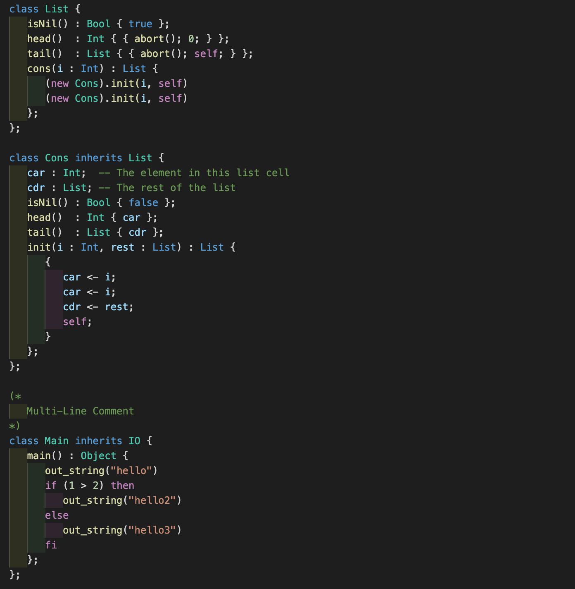

# COOL Syntax Highlighter

There currently is no Syntax Highlighting for COOL in VSCode, so I made my own. I'm also terrible with regex so if any improvements are welcome but it should be fine for the job.

__NOT A LINTER__

## Screenshot

## Some Syntax Stuff

### Keywords
> if | fi | else | then | loop | pool | while | case | esac

### Comments
> -- | (* *)

### Strings
> "" | ''

